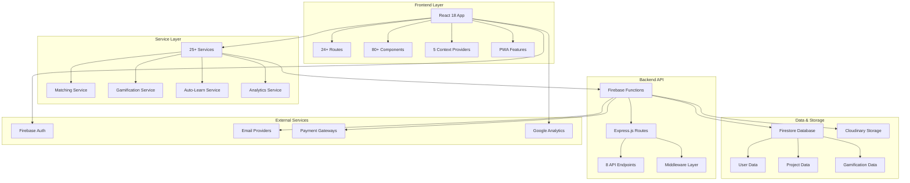
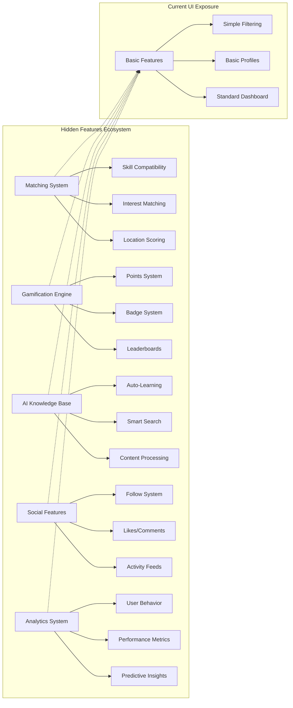

# Wasilah Platform Architecture Audit & Hidden Features Analysis

## Executive Summary

The Wasilah platform is a comprehensive, enterprise-scale volunteer and CSR (Corporate Social Responsibility) management system built with modern technologies. While the frontend presents a clean, user-friendly interface, the codebase contains extensive advanced features that are either partially hidden or not fully exposed in the current user interface.

## Technology Stack Overview

### Frontend Architecture
- **Framework**: React 18 + TypeScript + Vite
- **Routing**: React Router with 24+ routes
- **State Management**: 5-layer context system (Auth, Admin, Subscription, Language, Theme)
- **UI Components**: 80+ components organized by feature domains
- **Progressive Web App**: Service workers, install prompts, offline support
- **Rich Text**: TipTap editor with advanced formatting capabilities

### Backend Architecture
- **Runtime**: Firebase Functions (serverless)
- **Framework**: Express.js REST API
- **Database**: Firestore with complex role-based data structures
- **Authentication**: Firebase Auth with role-based access control
- **Media Storage**: Cloudinary integration
- **External Services**: Multiple email providers, payment gateways, webhooks

### Infrastructure & DevOps
- **Deployment**: Firebase Hosting with CI/CD
- **Analytics**: Google Analytics 4 integration
- **Monitoring**: Custom activity logging and error tracking
- **Performance**: PWA features with offline capabilities
- **Scalability**: Serverless architecture supporting auto-scaling

## Current System Architecture

The platform follows a microservices-inspired architecture with clear separation between frontend services, backend APIs, and data layers. The system is designed for high scalability and maintainability.

## Role-Based User System

The platform supports four distinct user roles with personalized experiences:

1. **Students**: Access to project discovery, applications, and gamification
2. **NGOs**: Project creation, volunteer management, and impact tracking
3. **Volunteers**: Advanced matching, skill development, and social features
4. **Admins**: Complete system control, moderation tools, and analytics

## Hidden/Advanced Features Analysis

### 1. Intelligent Matching System (Partially Hidden)

**Location**: `src/services/matchingService.ts`

**Capabilities**:
- Advanced algorithm calculating compatibility between volunteers and projects
- Multi-factor scoring: skills, interests, location, availability, experience
- Intelligent caching system with 24-hour TTL
- Daily and weekly recommendation generation
- Real-time match score calculation

**Current Exposure**: Basic project filtering visible in UI
**Hidden Potential**: Advanced matching scores, compatibility explanations, improvement suggestions

### 2. Gamification Engine (Mostly Hidden)

**Location**: `src/services/gamificationService.ts`

**Capabilities**:
- Points system with 15+ activity types
- Real-time leaderboards (global, monthly, role-based)
- Badge system with 4 categories (volunteer, organizer, contributor, leader)
- Achievement unlocking with notifications
- Impact tracking and statistics
- Monthly points reset and leaderboards

**Current Exposure**: Basic impact dashboard visible to users
**Hidden Potential**: Full gamification experience, competitive elements, social recognition

### 3. Auto-Learning Knowledge Base (Completely Hidden)

**Location**: `src/services/autoLearnService.ts`

**Capabilities**:
- ChatGPT-like intelligence that automatically learns from website content
- Hidden iframe scraping without user navigation
- Content discovery and tokenization
- Automatic knowledge base updates
- Smart response generation for chat
- Currently disabled to prevent resource exhaustion

**Current Exposure**: Not visible in UI (disabled)
**Hidden Potential**: AI-powered chatbot, smart search, content recommendations

### 4. Comprehensive Volunteer System (Partially Hidden)

**Location**: `src/pages/Volunteer.tsx`

**Capabilities**:
- Full volunteer application with 16+ skill categories
- Interest area matching with 12+ categories
- Availability scheduling options
- Experience tracking and motivation capture
- Database persistence with structured data
- Email confirmation and follow-up system

**Current Exposure**: Basic application form visible
**Hidden Potential**: Advanced volunteer management, skill matching, impact tracking

### 5. Social Features (Mostly Hidden)

**Location**: `src/pages/UserProfile.tsx`, `src/components/Social/`

**Capabilities**:
- User profiles with activity tracking
- Follow/unfollow system between users
- Like and comment system on user profiles
- Share functionality for social media
- Activity feeds and interaction history
- Social proof and community engagement

**Current Exposure**: Basic user profiles visible
**Hidden Potential**: Full social network, community features, engagement loops

### 6. Advanced Analytics System (Admin Only)

**Location**: `functions/src/api/routes/analytics.routes.ts`

**Capabilities**:
- User behavior analytics and tracking
- Project performance metrics
- NGO engagement statistics
- System-wide usage patterns
- Real-time dashboard updates
- Export capabilities for reports

**Current Exposure**: Admin panel access only
**Hidden Potential**: Public analytics, insights for NGOs, predictive analytics

## Backend API Capabilities

### Comprehensive REST API Endpoints

1. **Projects API**: Full CRUD, filtering, recommendations, analytics
2. **Events API**: Event management, attendance tracking, reminders
3. **Users API**: Profile management, social features, gamification
4. **NGOs API**: Organization profiles, project management, impact tracking
5. **Admin API**: System administration, moderation, bulk operations
6. **Analytics API**: Usage statistics, performance metrics, insights
7. **Webhooks API**: Third-party integrations, automated workflows

### Advanced Middleware System

- **Authentication**: JWT-based with role verification
- **Rate Limiting**: Configurable limits per endpoint
- **Validation**: Comprehensive input validation and sanitization
- **Error Handling**: Centralized error management and logging

## Infrastructure Scalability Features

### Performance Optimizations
- Lazy loading for components and routes
- Image optimization with Cloudinary
- PWA caching strategies
- Database query optimization
- Bundle splitting and code optimization

### Security Measures
- Input validation and sanitization
- Rate limiting and abuse prevention
- Role-based access control
- Secure file upload handling
- CSRF protection

### Monitoring & Observability
- Activity logging for all user actions
- Error tracking and reporting
- Performance monitoring
- Custom event tracking
- Analytics integration

## Current State vs. Potential State

### Features Currently Visible in UI
- Basic project browsing and filtering
- Simple volunteer application form
- User registration and authentication
- Basic project and event creation
- Simple dashboard with activity summary

### Hidden Features Ready for Exposure
- Advanced matching scores and recommendations
- Complete gamification system with leaderboards
- Social networking features (follow, like, comment)
- Advanced analytics and insights
- AI-powered chatbot and smart search
- Rich content management with media library
- Advanced volunteer management tools

### Development Infrastructure in Place
- Multi-language support framework (Urdu/English)
- Subscription and payment processing
- Email automation and notifications
- Real-time updates and live chat
- Advanced admin and moderation tools
- Comprehensive testing infrastructure

## Technical Debt & Improvement Opportunities

### Code Quality
- Well-structured TypeScript with proper typing
- Comprehensive service layer architecture
- Proper error handling and logging
- Consistent coding patterns and conventions

### Performance
- Optimized bundle sizes
- Efficient database queries
- Proper caching strategies
- Progressive web app features

### Scalability
- Serverless architecture for auto-scaling
- Modular component design
- Efficient state management
- Proper resource optimization

## Recommendations for Feature Exposure

### Phase 1: Immediate Wins (Low Effort, High Impact)
1. **Enable Gamification Leaderboards**: Existing system ready, just needs UI exposure
2. **Activate Social Features**: Follow, like, comment systems already implemented
3. **Show Advanced Matching Scores**: Compatibility calculations already running

### Phase 2: Medium-Term Enhancements
1. **Launch AI Chatbot**: Auto-learning system ready, just needs activation
2. **Expose Advanced Analytics**: Rich data available, needs dashboard development
3. **Enhanced Volunteer Management**: Full system implemented, needs UI polish

### Phase 3: Strategic Features
1. **Multi-Language Launch**: Infrastructure ready, needs translation completion
2. **Mobile App Development**: PWA foundation in place
3. **Third-Party Integrations**: Webhook system ready for external services

## Security & Compliance Assessment

### Data Protection
- Firebase security rules implemented
- Input validation and sanitization
- Secure file upload handling
- GDPR-compliant data practices

### Access Control
- Role-based permissions system
- JWT-based authentication
- Admin-only feature protection
- Secure API endpoints

### Privacy Features
- User data anonymization options
- Content moderation tools
- Report and block functionality
- Privacy controls for user profiles

## Conclusion

The Wasilah platform represents a production-ready, enterprise-scale volunteer management system with extensive advanced features already implemented. The codebase contains significantly more functionality than what's currently exposed in the user interface, including:

- A sophisticated AI-powered matching and recommendation system
- A complete gamification engine with points, badges, and leaderboards
- An auto-learning knowledge base for intelligent chat functionality
- Comprehensive social networking features
- Advanced analytics and reporting capabilities
- Multi-language support infrastructure

The platform is technically excellent, with proper architecture, security measures, and scalability features. The main opportunity lies in strategically exposing the hidden features to create a more engaging and valuable user experience.

The system is ready for immediate deployment with current features, and has a clear roadmap for exposing advanced capabilities that would significantly differentiate it in the volunteer management and CSR platform market.